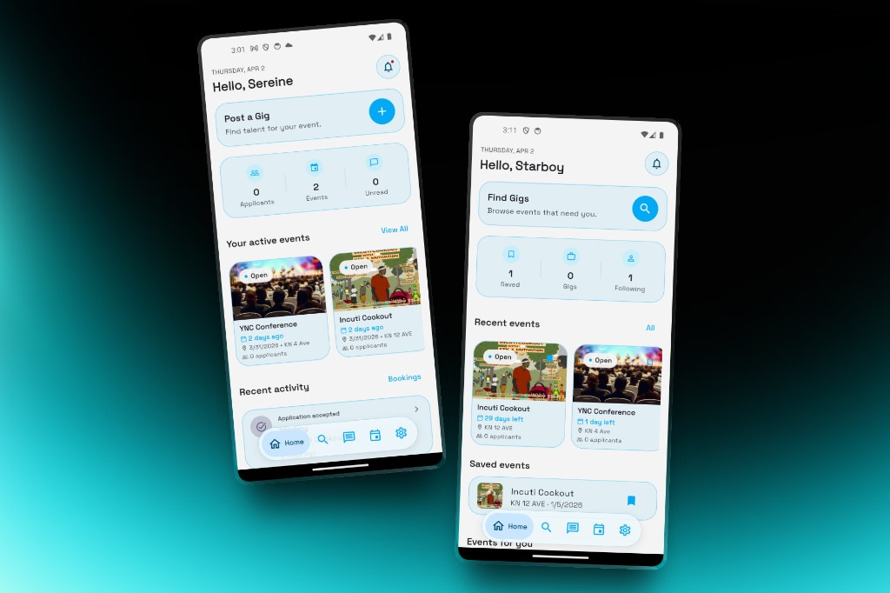
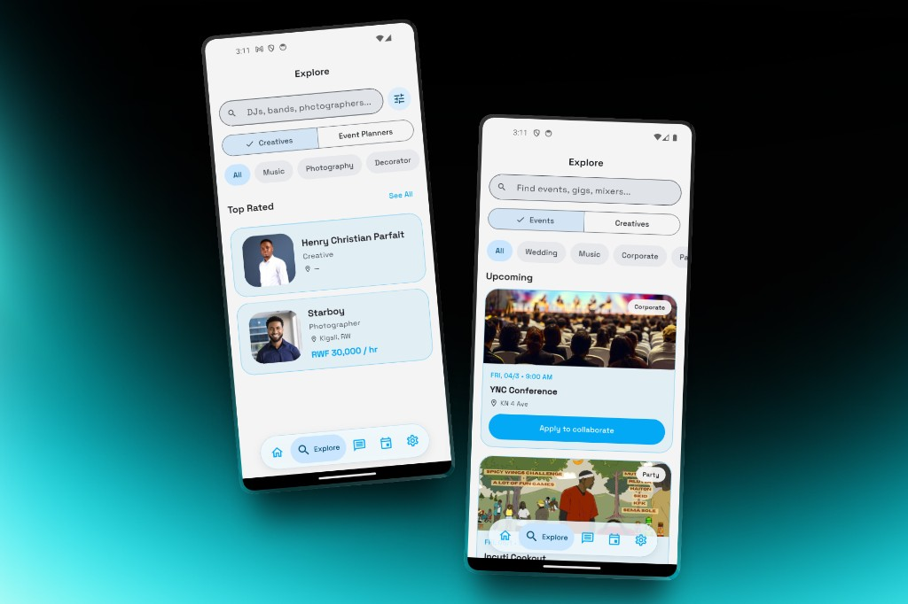
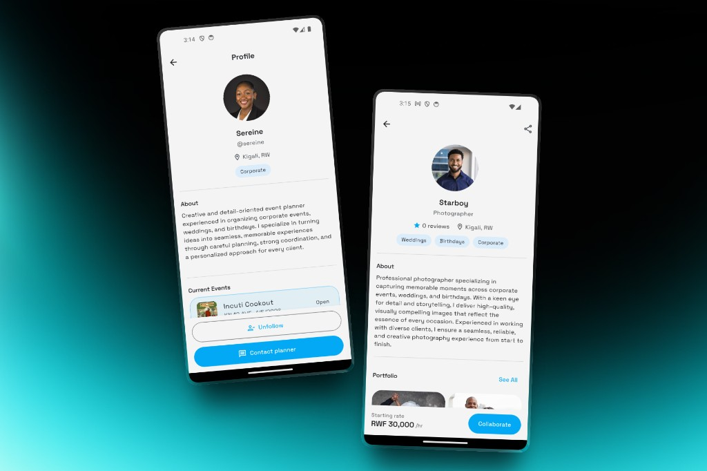
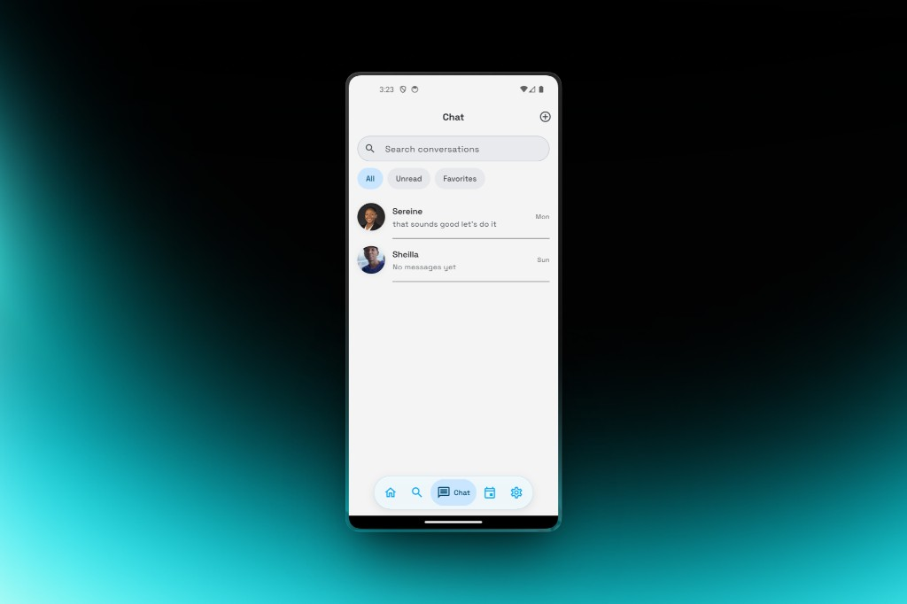

# LinkStage

[](https://flutter.dev)
[](LICENSE)

Mobile marketplace connecting event planners with creative professionals (DJs, photographers, decorators, content creators) in Rwanda.

**Stack:** Flutter · Firebase (Auth, Firestore, Hosting) · optional Supabase (signed uploads, push-related Edge Functions).

## Screenshots

Planner (left) · creative (right) in dual mockups. Source assets: [`docs/images/readme/`](docs/images/readme/).

| Home | Explore |
|------|---------|
|  |  |

| Profile | Chat |
|---------|------|
|  |  |

## Setup

**Requirements:** Flutter `^3.11.0` ([`pubspec.yaml`](pubspec.yaml)), toolchain that passes `flutter doctor`, a **Firebase** project for auth and Firestore. **Supabase** only if you use signed uploads or push helpers.

```bash
git clone https://github.com/supserrr/linkstage.git
cd linkstage
flutter pub get
flutter run
```

Before full auth, media, or push behavior works, configure Firebase (and Supabase if needed). Full steps: **[Developer setup](docs/setup.md)**.

## Documentation

- [Developer setup](docs/setup.md) — Firebase, Supabase, run, test, build, Android signing
- [ERD & Firestore rules](docs/erd.md)
- [State management](docs/state_management.md)

Other guides (chat, push, localization, icons, troubleshooting) are linked from [docs/setup.md](docs/setup.md#documentation).

## License

[MIT License](LICENSE).
