# LinkStage Entity-Relationship Diagram

## Overview

This document defines the Firestore data model for LinkStage. Field names in code must match the collection and field names below.

## ERD Diagram

```mermaid
erDiagram
    %% NOTE (for eraser.io): Firestore is hierarchical.
    %% - Boxes below represent Collections.
    %% - Entities with prefixes (e.g. users_saved_creatives) represent Subcollections:
    %%   users/{userId}/saved_creatives/{creativeUserId}
    %% - "FK" here means "stores the other doc's id as a field", not a database constraint.

    users ||--o{ profiles : "owns (creative profile)"
    users ||--o{ planner_profiles : "owns (planner profile)"
    users ||--o{ events : "creates"
    events ||--o{ bookings : "has"
    users ||--o{ bookings : "planner/creative"
    bookings ||--o{ reviews : "booking reviews"
    users ||--o{ collaborations : "requests/targets"
    collaborations ||--o{ reviews : "collab reviews"

    users ||--o{ users_saved_creatives : "saved_creatives subcollection"
    users ||--o{ users_followed_planners : "followed_planners subcollection"
    users ||--o{ users_device_tokens : "device_tokens subcollection"
    users ||--o{ users_notification_reads : "notification_reads subcollection"
    users ||--o{ users_accepted_event_ids : "accepted_event_ids subcollection"
    users ||--o{ users_planner_new_event_notifications : "planner_new_event_notifications subcollection"

    users ||--o| creative_past_work_preferences : "prefers (doc id = userId)"

    %% Chat (paths in firestore.rules)
    users ||--o| chat_users : "chat display doc"
    chats ||--o{ chats_users : "users subcollection"
    users ||--o{ chats_users : "is participant"
    chats ||--o{ chats_messages : "messages subcollection"
    users ||--o| user_chats : "chat list owner doc"
    user_chats ||--o{ user_chats_chats : "chats subcollection"
    chats ||--o{ user_chats_chats : "listed as chatId"

    users {
        string id PK
        string email
        string username
        string displayName
        string role
        string photoUrl
        timestamp createdAt
        timestamp lastUsernameChangeAt
        string profileVisibility
        string whoCanMessage
        boolean showOnlineStatus
        timestamp lastSeen
    }

    profiles {
        string id PK
        string userId FK
        string username
        string bio
        string category
        string priceRange
        string location
        array portfolioUrls
        array portfolioVideoUrls
        string availability
        array services
        array languages
        array professions
        number rating
        int reviewCount
        string displayName
        string profileVisibility
    }

    planner_profiles {
        string userId PK
        string bio
        string location
        array eventTypes
        array languages
        array portfolioUrls
        string displayName
        string role
        string profileVisibility
    }

    events {
        string id PK
        string plannerId FK
        string title
        timestamp date
        string location
        string description
        string status
        array imageUrls
        string eventType
        number budget
        string startTime
        string endTime
        string venueName
        boolean showOnProfile
        string locationVisibility
    }

    bookings {
        string id PK
        string eventId FK
        string creativeId FK
        string plannerId FK
        string status
        number agreedPrice
        timestamp createdAt
        timestamp plannerConfirmedAt
        timestamp creativeConfirmedAt
        boolean wasInvitation
    }

    reviews {
        string id PK
        string bookingId
        string collaborationId
        string reviewerId FK
        string revieweeId FK
        int rating
        string comment
        timestamp createdAt
        string reply
        timestamp replyAt
        int likeCount
        array likedBy
        int flagCount
        array flaggedBy
    }

    collaborations {
        string id PK
        string requesterId FK
        string targetUserId FK
        string description
        string status
        string title
        string eventId
        timestamp createdAt
        number budget
        timestamp date
        string startTime
        string endTime
        string location
        string eventType
        timestamp plannerConfirmedAt
        timestamp creativeConfirmedAt
    }

    creative_past_work_preferences {
        string userId PK
        array hiddenIds
        timestamp updatedAt
    }

    chat_users {
        string id PK
        string displayName
        string photoUrl
    }

    chats {
        string id PK
        string chat_room_type
    }

    chats_users {
        string userId PK
        string user_id
        string role
        string typing_status
        string user_active_status
        string membership_status
        timestamp membership_status_timestamp
        string pin_status
        timestamp pin_status_timestamp
        string mute_status
    }

    user_chats {
        string userId PK
    }

    user_chats_chats {
        string chatId PK
        string user_id
        timestamp created_at
        string last_message_text
        timestamp last_message_at
        string last_message_sender_id
        timestamp last_read_at
        int unread_count
    }

    chats_messages {
        string messageId PK
        string sentBy FK
        string message
        timestamp createdAt
    }

    users_saved_creatives {
        string creativeUserId PK
        timestamp savedAt
    }

    users_followed_planners {
        string plannerId PK
        timestamp followedAt
    }

    users_device_tokens {
        string tokenId PK
        string token
        timestamp updatedAt
    }

    users_notification_reads {
        string notificationId PK
        timestamp readAt
    }

    users_accepted_event_ids {
        string eventId PK
    }

    users_planner_new_event_notifications {
        string docId PK
        timestamp createdAt
    }
```

## Firestore Collections

### users

| Field                | Type      | Description |
| -------------------- | --------- | ----------- |
| id                   | string    | Document ID (Firebase Auth UID) |
| email                | string    | User email |
| username             | string?   | Normalized username (set via username flow) |
| displayName          | string?   | Optional display name |
| photoUrl             | string?   | Optional profile photo URL |
| role                 | string    | `event_planner` or `creative_professional` |
| createdAt            | timestamp | Set on first write |
| lastUsernameChangeAt| timestamp? | Timestamp when username last changed |
| profileVisibility   | string?   | `everyone`, `connections_only`, `only_me` |
| whoCanMessage        | string?   | `everyone`, `worked_with`, `no_one` |
| showOnlineStatus     | boolean   | Used for presence display |
| lastSeen            | timestamp? | Last time user was seen |

### profiles

| Field              | Type    | Description |
| ------------------ | ------- | ----------- |
| id                 | string  | Document ID (normalized username) |
| userId             | string  | FK to `users.id` |
| username          | string  | Same as `id` (lowercased username) |
| bio                | string  | Bio/description |
| category           | string | Profile category key |
| priceRange        | string  | e.g. "50,000-100,000 RWF" |
| location          | string  | Location |
| portfolioUrls     | array   | Portfolio image URLs (hosted on Supabase Storage) |
| portfolioVideoUrls| array   | Portfolio video URLs (hosted on Supabase Storage) |
| availability       | string? | `open_to_work` or `not_available` |
| services          | array   | Services and specializations (merged from `services` + `specializations`) |
| languages         | array   | List of language codes |
| professions       | array   | User-typed professions |
| rating            | number  | Average rating |
| reviewCount       | int     | Number of reviews |
| displayName       | string? | Optional display name |
| profileVisibility | string? | `everyone`, `connections_only`, `only_me` |

### planner_profiles

Planner-specific profile data, stored separately from `profiles` (which represent creatives).

| Field              | Type    | Description |
| ------------------ | ------- | ----------- |
| userId             | string  | Document ID (and stored field); FK to `users.id` |
| bio                | string  | Planner bio |
| location           | string  | Planner location |
| eventTypes         | array   | Event types the planner supports |
| languages          | array   | Language codes |
| portfolioUrls      | array   | Portfolio image URLs |
| displayName        | string? | Optional display name |
| role               | string? | Optional role key (mirrors `users.role` when present) |
| profileVisibility  | string? | `everyone`, `connections_only`, `only_me` |

### events

| Field              | Type      | Description |
| ------------------ | --------- | ----------- |
| id                 | string    | Document ID |
| plannerId          | string    | FK to `users.id` |
| title              | string    | Event title |
| date               | timestamp | Event date |
| location           | string    | Event location |
| description        | string    | Event description |
| status             | string    | `draft`, `open`, `booked`, `completed` |
| imageUrls          | array     | Event image URLs (hosted on Supabase Storage) |
| locationVisibility | string    | `public`, `private`, `acceptedCreatives` |
| eventType          | string    | Wedding, Corporate, etc. |
| budget             | number?   | Budget in RWF |
| startTime          | string    | e.g. "09:00" |
| endTime            | string    | e.g. "17:00" |
| venueName          | string    | Optional venue name |
| showOnProfile      | boolean   | Whether to display on profile |

### bookings

| Field               | Type      | Description |
| ------------------- | --------- | ----------- |
| id                  | string    | Document ID |
| eventId             | string    | FK to `events.id` |
| creativeId          | string    | FK to `users.id` (creative) |
| plannerId           | string    | FK to `users.id` (planner) |
| status              | string    | `pending`, `invited`, `accepted`, `declined`, `completed` |
| agreedPrice         | number?  | Agreed price in RWF |
| createdAt           | timestamp | Creation time |
| plannerConfirmedAt  | timestamp? | When planner marked complete |
| creativeConfirmedAt | timestamp? | When creative confirmed completion |
| wasInvitation       | boolean?  | Whether this booking was created via an invitation |

Planner dashboard uses `getPendingBookingsByPlannerId(plannerId)` (query: `plannerId` + `status == 'pending'`, orderBy `createdAt` desc) for applicants count, recent activity, and per-event "+N New" counts.

### chat_users

This collection is used to store chat display info for a user (separate from the app's main `users` collection).

| Field        | Type    | Description |
| ------------ | ------- | ----------- |
| id           | string  | Document ID (also stored as `id`) |
| displayName  | string? | Optional display name |
| photoUrl     | string? | Optional profile photo URL |

### chats

| Field            | Type    | Description |
| ---------------- | ------- | ----------- |
| id               | string  | Document ID (chatId) |
| chat_room_type  | string  | e.g. `oneToOne` |

### chats/{chatId}/users (subcollection)

| Field                        | Type      | Description |
| ---------------------------- | --------- | ----------- |
| user_id                     | string    | FK to `users.id` (participant) |
| role                         | string    | Participant role in chat |
| typing_status               | string    | Typing status |
| user_active_status          | string    | Online/offline state |
| membership_status          | string    | Chat membership status |
| membership_status_timestamp | timestamp | When membership status was set |
| pin_status                  | string    | Pin status |
| pin_status_timestamp        | timestamp | When pin status was set |
| mute_status                 | string    | Mute status |

### user_chats/{userId}/chats (subcollection)

`userId` is the current owner of the chat list. Each document id inside this subcollection is the `chatId`.

| Field                  | Type      | Description |
| ---------------------- | --------- | ----------- |
| user_id               | string    | The other participant's `users.id` |
| created_at           | timestamp | When this user started/created the chat entry |
| last_message_text    | string?   | Last message preview text |
| last_message_at      | timestamp? | Timestamp of last message |
| last_message_sender_id | string? | Sender of last message |
| last_read_at         | timestamp? | When the owner last read this chat |
| unread_count         | int       | Unread message count for owner |

### chats/{chatId}/messages (subcollection)

| Field       | Type      | Description |
| ------------ | --------- | ----------- |
| id           | string    | Document ID (message id) |
| sentBy       | string    | FK to `users.id` (sender) |
| message      | string    | Message text |
| createdAt    | timestamp | Send time |

### users/{userId}/saved_creatives (subcollection)

Each document id is the `creativeUserId` being saved.

| Field          | Type      | Description |
| --------------| --------- | ----------- |
| creativeUserId | string    | FK to `users.id` (creative) |
| savedAt        | timestamp | When the creative was saved |

### users/{userId}/followed_planners (subcollection)

Each document id is the `plannerId` being followed.

| Field      | Type      | Description |
| ---------- | --------- | ----------- |
| plannerId  | string    | FK to `users.id` (planner) |
| followedAt | timestamp | When the planner was followed |

### users/{userId}/device_tokens (subcollection)

Stores FCM tokens per device. Document IDs are derived from the token hash.

| Field     | Type      | Description |
| --------- | --------- | ----------- |
| token     | string    | FCM token string |
| updatedAt | timestamp | Last updated time |

### users/{userId}/notification_reads (subcollection)

Marks notification IDs as read for the user.

| Field  | Type      | Description |
| ------ | --------- | ----------- |
| readAt | timestamp | When the notification was marked as read |

### users/{userId}/planner_new_event_notifications (subcollection)

Denormalized notification docs created for a user when a followed planner publishes an event.

| Field     | Type      | Description |
| --------- | --------- | ----------- |
| createdAt | timestamp | When this notification doc was created |

### users/{userId}/accepted_event_ids (subcollection)

Denormalized by a server-side function when a booking is accepted; used for event `locationVisibility == acceptedCreatives`.
Each document id is the `eventId`. (Client reads only; server writes.)

| Field | Type | Description |
| ----- | ---- | ----------- |
| (none) | - | Presence-only doc; document ID encodes the accepted event |

### creative_past_work_preferences

Visibility preferences for a creative’s completed collaborations (past work).

| Field     | Type      | Description |
| --------- | --------- | ----------- |
| userId    | string    | FK to `users.id` (creative) |
| hiddenIds | array     | Collaboration IDs hidden from public/past-work views |
| updatedAt | timestamp | Last updated time |

### reviews

| Field      | Type     | Description                         |
| ---------- | -------- | ----------------------------------- |
| id             | string   | Document ID |
| bookingId      | string   | FK to `bookings.id` (empty string for collaboration reviews) |
| collaborationId| string   | FK to `collaborations.id` (empty string for booking reviews) |
| reviewerId     | string   | FK to `users.id` (who wrote it) |
| revieweeId     | string   | FK to `users.id` (who is reviewed) |
| rating         | int      | 1-5 stars |
| comment        | string   | Review text |
| createdAt      | timestamp| When review was created |
| reply          | string   | Reviewee's reply |
| replyAt        | timestamp| When reply was added |
| likeCount      | int      | Number of likes |
| likedBy        | array    | User IDs who liked |
| flagCount      | int      | Number of flags |
| flaggedBy      | array    | User IDs who flagged |

### collaborations

| Field        | Type      | Description                                    |
| ------------ | --------- | ---------------------------------------------- |
| id           | string    | Document ID                                    |
| requesterId  | string    | FK to users.id (planner or creative who sent)  |
| targetUserId | string    | FK to users.id (creative who receives)         |
| description  | string    | What the requester wants / brief               |
| status       | string    | `pending`, `accepted`, `declined`, `completed` |
| title        | string?   | Project or event name (for direct proposals)   |
| eventId      | string?   | Optional FK to events.id (if tied to an event) |
| createdAt    | timestamp | When proposal was sent                         |
| budget       | number?   | Budget in RWF (planner proposals)              |
| date         | timestamp?| Event/gig date (planner proposals)             |
| startTime    | string?   | Start time e.g. "09:00" (planner proposals)    |
| endTime      | string?   | End time e.g. "17:00" (planner proposals)      |
| location     | string?   | Event location (planner proposals)             |
| eventType    | string?   | Wedding, Corporate, etc. (planner proposals)   |
| plannerConfirmedAt | timestamp? | When planner marked done                   |
| creativeConfirmedAt| timestamp? | When creative confirmed completion          |

Collaboration proposals allow planners or creatives to send a brief to a creative. When the requester is an event planner, optional event details (budget, date, time, location, event type) can be included. The target creative sees pending proposals in the Gigs tab and can Accept or Decline. On Accept, they can chat with the requester.

## Storage (Supabase)

Portfolio media (images and videos) are stored in Supabase Storage at `users/{userId}/portfolio/images/` and `users/{userId}/portfolio/videos/`. Profile documents in Firestore store the resulting public URLs in `portfolioUrls` and `portfolioVideoUrls`.

Uploads go through the `portfolio-upload` Edge Function, which verifies the Firebase ID token before writing. Ensure Supabase storage policies (RLS) restrict direct client writes; the Edge Function should use the service role for storage writes.

## Composite Indexes

Defined in `firestore.indexes.json`:

- events: plannerId (ASC) + date (DESC)
- bookings: creativeId (ASC) + status (ASC)
- bookings: plannerId (ASC) + status (ASC)
- bookings: plannerId (ASC) + status (ASC) + createdAt (DESC) — for planner dashboard (pending bookings by planner, ordered by creation time)
- profiles: category (ASC) + location (ASC)
- profiles: category (ASC) + rating (DESC)
- collaborations: targetUserId (ASC) + createdAt (DESC)
- collaborations: targetUserId (ASC) + status (ASC) + createdAt (DESC)
- collaborations: requesterId (ASC) + targetUserId (ASC) + status (ASC)
